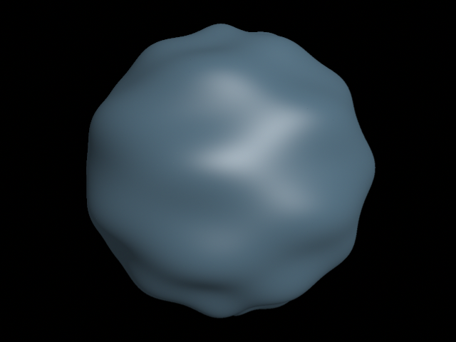

# Reyes

*Reyes* is a toy micropolygon renderer based on the architecture described in the original REYES paper and The RenderMan Interface v3.2.1 from Pixar.

## Features

- Simple REYES-based micropolygon renderer
- Based on the [RenderMan Interface Specification v3.2.1](https://en.wikipedia.org/wiki/RenderMan_Interface_Specification)
- Compiler and virtual machine implementing the RenderMan Shading Language
- Complete hierarchical graphics state
- Orthographic and perspective projections
- Depth based hidden surface elimination
- Pixel filtering and anti-aliasing
- Gamma correction and dithering
- Outputs PNG or raw images
- Quadrics, linear patches, cubic patches, and polygons
- Texture, shadow, and environment mapping
- Standard surface, light, and displacement shaders

## Example

~~~c++
#include <reyes/Grid.hpp>
#include <reyes/Value.hpp>
#include <reyes/Options.hpp>
#include <reyes/Renderer.hpp>
#include <math/vec3.ipp>
#define _USE_MATH_DEFINES
#include <math.h>

using namespace math;
using namespace reyes;

void render_wavy_sphere_example()
{  
    Options options;
    options.set_gamma( 1.0f / 2.2f );
    options.set_resolution( 640, 480, 1.0f );
    options.set_dither( 1.0f );
    options.set_filter( &Options::gaussian_filter, 2.0f, 2.0f );

    Renderer renderer;
    renderer.set_options( options );
    renderer.begin();
    renderer.perspective( 0.25f * float(M_PI) );
    renderer.projection();
    renderer.translate( 0.0f, 0.0f, 24.0f );
    renderer.begin_world();

    Grid& ambientlight = renderer.light_shader( SHADERS_PATH "ambientlight.sl" );
    ambientlight["intensity"] = 0.4f;
    ambientlight["lightcolor"] = vec3( 1.0f, 1.0f, 1.0f );

    Grid& pointlight = renderer.light_shader( SHADERS_PATH "pointlight.sl" );
    pointlight["intensity"] = 4096.0f;
    pointlight["lightcolor"] = vec3( 1.0f, 1.0f, 1.0f );
    pointlight["from"] = vec3( 25.0f, 25.0f, -50.0f );

    Grid& wavy = renderer.displacement_shader( SHADERS_PATH "wavy.sl" );
    wavy["Km"] = 0.2f;
    wavy["sfreq"] = 24.0f;
    wavy["tfreq"] = 32.0f;
    
    Grid& plastic = renderer.surface_shader( SHADERS_PATH "plastic.sl" );
    plastic["Ka"] = 0.5f;
    plastic["Kd"] = 0.4f;
    plastic["Ks"] = 0.4f;
    plastic["roughness"] = 0.05f;
    
    renderer.identity();
    renderer.translate( vec3(0.0f, 0.0f, 0.0f) );
    renderer.rotate( 0.5f * float(M_PI), 1.0f, 0.0f, 0.0f );
    renderer.two_sided( true );
    renderer.color( vec3(0.3f, 0.55f, 0.75f) );
    renderer.sphere( 6.0f );

    renderer.end_world();
    renderer.end();
    renderer.save_image_as_png( REYES_EXAMPLES_PATH "wavy_sphere.png" );
}
~~~

~~~
displacement wavy(
    float Km = 1;
    float sfreq = 32;
    float tfreq = 32;
)
{
    float amp = Km * sin(sfreq * s) * cos(tfreq * t);
    P += amp * normalize(N);
    N = calculatenormal(P);
}
~~~

## Installation

*Reyes* is built with GCC, XCode, or Visual Studio using the [Forge](https:/www.github.com/cwbaker/forge#forge) build tool.

**Linux:**

- Install GCC
- Install [Forge](https:/www.github.com/cwbaker/forge#forge)
- Run the following from a shell:

~~~bash
git clone git@github.com:cwbaker/reyes.git reyes
cd reyes
git submodule update --init
forge variant=release
./release/bin/reyes_examples
~~~

**macOS:**

- Install Xcode
- Install [Forge](https:/www.github.com/cwbaker/forge#forge)
- Run the following from a shell:

~~~bash
git clone git@github.com:cwbaker/reyes.git reyes
cd reyes
git submodule update --init
forge variant=release
./release/bin/reyes_examples
~~~

**Windows:**

- Install Visual Studio 2017
- Install [Forge](https:/www.github.com/cwbaker/forge#forge)
- Run the following from a command prompt:

~~~
git clone git@github.com:cwbaker/reyes.git reyes
cd reyes
git submodule update --init
forge variant=release
.\release\bin\reyes_examples.exe
~~~

## Usage

*Reyes* is a C++ library that generates images from geometry, textures, and shaders based on the architecture described in the original REYES paper and [the RenderMan Interface Specification](https://en.wikipedia.org/wiki/RenderMan_Interface_Specification) v3.2.1 from Pixar. 

The *Renderer*, *Grid*, *Value*, and *Options* classes form the public interface to the renderer.  The *Renderer* class provides the main interface to the library for application code.  The *Options* class allows application code to override the default per-frame options used by the renderer.  The *Grid* and *Value* classes are used to provide a collection of values that is used to represent the parameters passed to shaders and the vertices in a piece of diced geometry.

Other classes are used behind the scenes to represent geometry as it is passed through the bound and split phase of the renderer (*Cone*, *CubicPatch*, *Cylinder*, *Disk*, *Hyperboloid*, *LinearPatch*, *Paraboloid*, *Sphere*, *Torus*, and *Geometry*); to support compilation and execution of shaders (*ShaderParser*, *SemanticAnalyzer*, *CodeGenerator*, *SymbolTable*, *Symbol*, *SyntaxNode*, and *VirtualMacine*); to represent a level of hierarchical graphics state (*Attributes*); to represent sample and image buffers (*SampleBuffer* and *ImageBuffer*); to handle sampling a diced grid into a sample buffer (*Sampler*); and to dump out various information that is useful when debugging the renderer (*Debugger*).

The library needs no special initialization.  Constructing a *Renderer* object and then making a valid sequence of calls on it generates an image of some kind.  Default options can be overridden by constructing an *Options* object, setting the desired options values on it, and passing it to the *Renderer* before the begin function is called.

## Contributions

This isn't really an active project so don't worry about opening pull requests or issues.  Please fork and tinker if you are interested and other feedback is always welcome.  Thanks!

## License

*Reyes* is licensed under the [MIT License](http://www.opensource.org/licenses/MIT)
